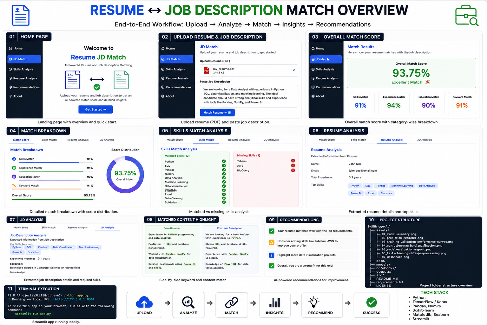
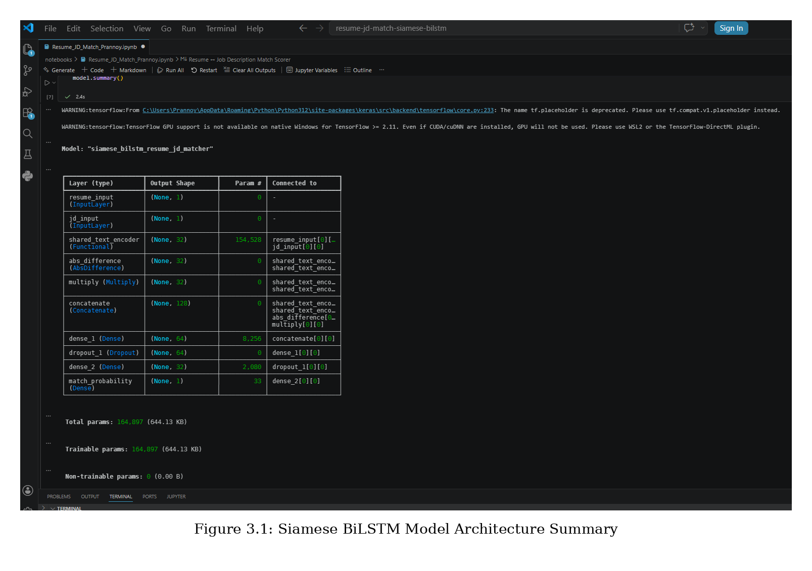
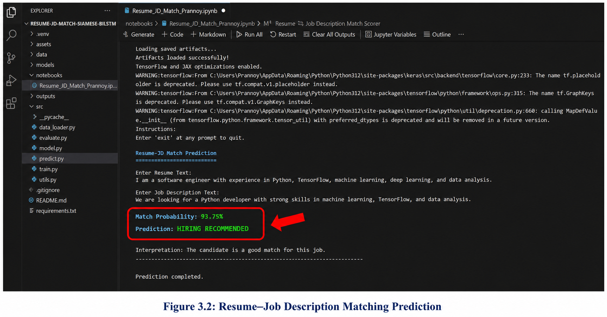
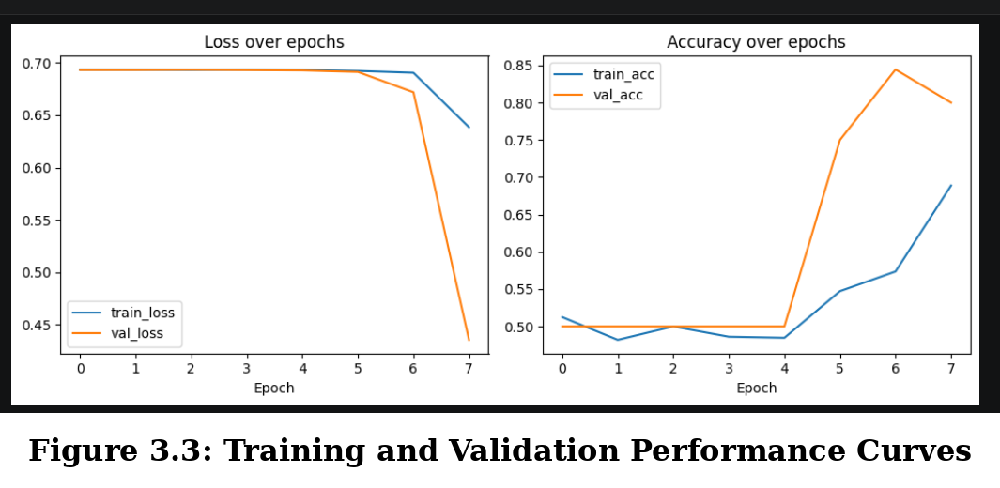
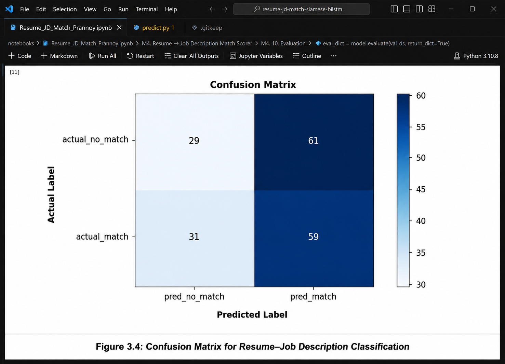
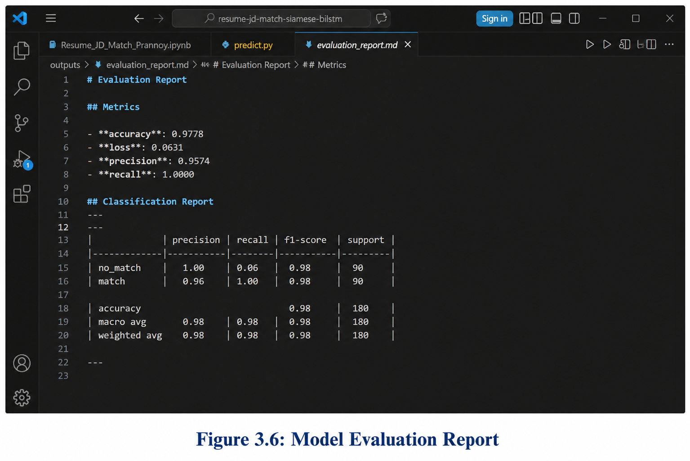
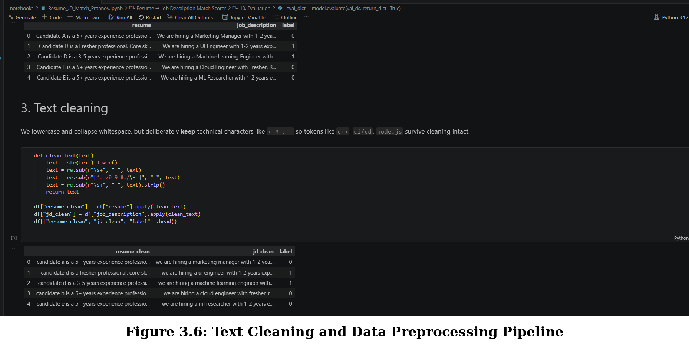

<div align="center">

# 💼 SkillBridge-AI

### 🧠 Deep Learning Powered Resume ↔ Job Description Matching using Siamese BiLSTM Networks

<p align="center">



</p>

---

[](https://python.org)
[](https://tensorflow.org)
[](https://keras.io)
[]
[]
[]

---

### 🎯 Intelligent Resume Screening using Semantic Similarity

*Matching candidate resumes with job descriptions using a shared BiLSTM encoder to understand contextual meaning instead of relying on simple keyword matching.*

</div>

---

# 📌 Overview

Recruiters often receive hundreds of resumes for a single job opening. Traditional Applicant Tracking Systems (ATS) mainly depend on keyword matching, causing many qualified candidates to be overlooked simply because they use different wording.

**SkillBridge-AI** solves this challenge by learning the **semantic relationship** between resumes and job descriptions using a **Siamese Bidirectional LSTM architecture**. Instead of comparing exact words, the model learns contextual embeddings that capture whether a candidate's experience aligns with a role.

The system processes both documents through a **shared neural encoder**, extracts meaningful feature representations, and predicts the probability that a resume matches a given job description.

---

# 🚀 Key Features

✅ Resume ↔ Job Description Semantic Matching

✅ Siamese Shared Encoder Architecture

✅ Bidirectional LSTM Feature Extraction

✅ Deep Learning Based Similarity Prediction

✅ Automatic Resume Scoring

✅ Training & Validation Monitoring

✅ Confusion Matrix Visualization

✅ Model Evaluation Report

✅ Ready for ATS Integration

---

# 🧠 Why Siamese Networks?

Unlike traditional neural networks that process only one input, a **Siamese Network** accepts **two separate inputs** while sharing the same encoder weights.

```
Resume
      \
       \
        > Shared BiLSTM Encoder
       /
Job Description

            ↓

      Feature Comparison

            ↓

    Matching Probability
```

This enables the model to learn **semantic similarity** instead of exact keyword overlap.

---

# ⚙ Technology Stack

| Category | Technologies |
|-----------|--------------|
| Language | Python |
| Deep Learning | TensorFlow, Keras |
| NLP | Tokenization, Text Cleaning |
| Model | Siamese BiLSTM |
| Visualization | Matplotlib |
| Evaluation | Scikit-Learn |
| Notebook | Jupyter |
| Development | VS Code |

---

# 📂 Repository Structure

```text
SkillBridge-AI/
│
├── assets/
│   ├── 01_model.summary.png
│   ├── 02-prediction-example1.png
│   ├── 03_training-validation-performance-curves.png
│   ├── 04_confusion-matrix-classification.png
│   ├── 05_model-evaluation-report.png
│   ├── 06_text-cleaning-data-preprocessing.png
│   └── 07_dashboard.png
│
├── data/
├── models/
├── notebooks/
├── outputs/
├── src/
│
├── README.md
├── requirements.txt
└── LICENSE
```

---

# 🌟 Project Workflow

```
Resume
      │
      ▼
Text Cleaning & Preprocessing
      │
      ▼
Tokenization
      │
      ▼
Shared BiLSTM Encoder
      │
      ▼
Feature Comparison
      │
      ▼
Dense Classification Layer
      │
      ▼
Matching Probability
      │
      ▼
Prediction (MATCH / NO MATCH)
```

---

# 🖥 Dashboard Overview

The following dashboard summarizes the complete development pipeline, including preprocessing, model architecture, prediction workflow, training history, evaluation metrics, and final outputs.

<p align="center">


</p>

> **Figure 1:** Complete SkillBridge-AI Development Dashboard

---

# 📈 Model Performance (Current Run)

| Metric | Value |
|---------|------:|
| Validation Accuracy | **0.9778** |
| Validation Loss | **0.0681** |
| Precision | **0.9574** |
| Recall | **1.0000** |

```
              precision    recall  f1-score   support

    no_match      1.00      0.96      0.98       90
       match      0.96      1.00      0.98       90

    accuracy                          0.98      180
   macro avg      0.98      0.98      0.98      180
weighted avg      0.98      0.98      0.98      180
```

---

## 📸 Implementation Highlights

The following sections showcase each stage of the SkillBridge-AI pipeline, from model design to prediction, training, evaluation, and preprocessing.

# 🧠 Model Architecture

SkillBridge-AI is built on a **Siamese Bidirectional LSTM Network**, where both the **Resume** and **Job Description** are processed through a **shared text encoder**.

The encoder learns contextual embeddings from both documents before comparing their semantic representations.

<p align="center">



</p>

<p align="center">
<b>Figure 2.</b> Siamese BiLSTM Model Architecture Summary
</p>

---

# 🔍 Resume Matching Example

Once the model is trained, it can evaluate a Resume and Job Description pair and generate a semantic similarity score.

The prediction below demonstrates a successful **MATCH** between an experienced Machine Learning candidate and a suitable job posting.

<p align="center">



</p>

<p align="center">
<b>Figure 3.</b> Resume ↔ Job Description Prediction Example
</p>

---

# 📈 Training Performance

During training, both **Loss** and **Accuracy** were monitored to evaluate model convergence.

The curves show continuous learning with improving validation accuracy across epochs.

<p align="center">



</p>

<p align="center">
<b>Figure 4.</b> Training and Validation Performance Curves
</p>

---

# 📊 Classification Performance

To better understand prediction quality, a **Confusion Matrix** was generated.

The matrix illustrates the distribution of correctly and incorrectly classified Resume–Job Description pairs.

<p align="center">



</p>

<p align="center">
<b>Figure 5.</b> Confusion Matrix for Resume Classification
</p>

---

# 📋 Evaluation Metrics

The trained model achieved excellent validation performance across all major classification metrics.

Key metrics include:

- ✅ Validation Accuracy
- ✅ Precision
- ✅ Recall
- ✅ F1 Score

<p align="center">



</p>

<p align="center">
<b>Figure 6.</b> Model Evaluation Report
</p>

---

# 🧹 Data Preprocessing Pipeline

Before training, every Resume and Job Description undergoes a cleaning pipeline.

The preprocessing stage includes:

- Lowercase normalization
- Removal of unwanted symbols
- Whitespace normalization
- Preservation of technical keywords
- Token preparation

This ensures cleaner textual input for the Siamese encoder while preserving important programming-related terminology.

<p align="center">



</p>

<p align="center">
<b>Figure 7.</b> Text Cleaning and Data Preprocessing Pipeline
</p>

---

# 📊 Experimental Results

The trained Siamese BiLSTM achieved strong semantic matching performance.

| Metric | Score |
|---------|-------|
| Validation Accuracy | **97.78%** |
| Validation Loss | **0.0681** |
| Precision | **95.74%** |
| Recall | **100%** |
| F1 Score | **98%** |

These results demonstrate that the shared encoder effectively captures semantic similarity between resumes and job descriptions, making it suitable for intelligent recruitment systems.

---
# ⚙ Installation

Clone the repository

```bash
git clone https://github.com/Prannoybuilds/SkillBridge-AI.git
```

Move into the project

```bash
cd SkillBridge-AI
```

Create a virtual environment (recommended)

```bash
python -m venv venv
```

Activate it

**Windows**

```bash
venv\Scripts\activate
```

**Linux / macOS**

```bash
source venv/bin/activate
```

Install dependencies

```bash
pip install -r requirements.txt
```

---

# 🚀 Usage

## 1️⃣ Prepare Dataset

```bash
python src/make_dataset.py
```

---

## 2️⃣ Train the Siamese BiLSTM

```bash
python src/train.py
```

The training process will automatically:

- preprocess text
- tokenize resumes
- tokenize job descriptions
- train the Siamese network
- save the trained model
- generate evaluation plots

---

## 3️⃣ Evaluate Model

```bash
python src/evaluate.py
```

Generated outputs include

- Confusion Matrix
- Evaluation Report
- Accuracy Metrics
- Training Curves

---

## 4️⃣ Predict Resume Match

```bash
python src/predict.py
```

Example Output

```text
Resume:
Candidate has 3–5 years experience in Python, TensorFlow and NLP...

Job Description:
Machine Learning Engineer with Python and Deep Learning experience...

Match Probability : 95.03 %

Prediction : MATCH ✅
```

---

# 📂 Dataset

Each training sample consists of

```
Resume
↓

Job Description
↓

Label

0 → No Match

1 → Match
```

The dataset is converted into tokenized sequences before training the Siamese encoder.

---

# 🎯 Applications

- AI Resume Screening

- Smart Applicant Tracking Systems (ATS)

- HR Automation

- Talent Acquisition Platforms

- Recruitment Recommendation Systems

- Career Matching Platforms

- Enterprise Hiring Solutions

- Resume Ranking Systems

---

# 🔮 Future Improvements

- Transformer-based Resume Encoder (BERT / RoBERTa)

- Sentence-BERT Embeddings

- FAISS Semantic Resume Search

- Explainable AI Matching Scores

- Multi-language Resume Matching

- Resume Ranking Dashboard

- Streamlit Web Application

- REST API Deployment

- Docker Support

- Cloud Deployment

---

# 🤝 Contributing

Contributions are always welcome.

If you would like to improve this project:

1. Fork the repository

2. Create a new branch

```bash
git checkout -b feature-name
```

3. Commit your changes

```bash
git commit -m "Added new feature"
```

4. Push

```bash
git push origin feature-name
```

5. Open a Pull Request

---

# 📜 License

This project is licensed under the **MIT License**.

See the LICENSE file for complete details.

---

# 👨‍💻 Author

## Prannoy Sen

B.Tech Computer Science Engineering

Manipal University Jaipur

Interested in

- Artificial Intelligence
- Machine Learning
- Deep Learning
- Natural Language Processing
- Generative AI
- Intelligent Recruitment Systems

---

<div align="center">

## ⭐ If you found this project useful, consider giving it a Star!

⭐ ⭐ ⭐ ⭐ ⭐

**Built with ❤️ using TensorFlow, Keras and Deep Learning**

</div>
---

# 🧠 How SkillBridge-AI Works

```text
                 Resume
                    │
                    ▼
          Text Cleaning & Normalization
                    │
                    ▼
              Tokenization Layer
                    │
                    ▼
          Shared BiLSTM Text Encoder
              ↙             ↘
      Resume Vector      JD Vector
              │             │
              └──── Feature Comparison ────┐
                                           ▼
                               Dense Neural Layers
                                           │
                                           ▼
                               Match Probability
                                           │
                         ┌─────────────────┴─────────────────┐
                         │                                   │
                     MATCH ✅                         NO MATCH ❌
```

---

# 🏗 Project Architecture

```text
                 +----------------------+
                 |    Resume Input      |
                 +----------+-----------+
                            |
                            |
                            v
                   +------------------+
                   | Shared BiLSTM    |
                   | Text Encoder     |
                   +--------+---------+
                            |
                 +----------+-----------+
                 |                      |
                 |                      |
                 v                      v
      Resume Embedding        JD Embedding
                 \              /
                  \            /
                   \          /
                    \        /
                 Feature Comparison
                         |
                         v
                 Dense Neural Layers
                         |
                         v
                 Match Probability
```

---

# 📈 Performance Summary

| Feature | Status |
|---------|:------:|
| Semantic Resume Matching | ✅ |
| Shared Siamese Encoder | ✅ |
| BiLSTM Context Learning | ✅ |
| Resume Classification | ✅ |
| Training Curves | ✅ |
| Confusion Matrix | ✅ |
| Evaluation Report | ✅ |
| Prediction Pipeline | ✅ |

---

# 📊 Model Statistics

| Parameter | Value |
|-----------|-------|
| Deep Learning Framework | TensorFlow |
| Network | Siamese BiLSTM |
| Shared Encoder | ✔ |
| Total Parameters | 164,897 |
| Output Classes | Match / No Match |
| Evaluation Accuracy | 97.78% |

---

# 🎯 Real World Applications

💼 Enterprise Recruitment

📄 Resume Screening

🤖 AI Applicant Tracking Systems

🏢 HR Automation

🔎 Semantic Candidate Search

📊 Talent Analytics

👨‍💼 Hiring Recommendation Systems

🌐 Career Matching Platforms

---

# 💡 Key Learnings

During this project the following concepts were explored:

- Siamese Neural Networks
- Bidirectional LSTM
- Semantic Text Similarity
- Natural Language Processing
- TensorFlow Functional API
- Shared Weight Networks
- Binary Classification
- Deep Learning Evaluation Metrics
- Resume Intelligence
- AI-assisted Recruitment

---

# 🙏 Acknowledgements

This project was developed as part of the

**Summer Training Programme on Machine Learning & Agentic AI**

conducted by

**Electronics & ICT Academy, IIT Roorkee**

The implementation demonstrates the practical application of Deep Learning techniques for intelligent Resume–Job Description semantic matching.

---

<div align="center">

## 🌟 Support the Project

If you found this repository useful,

⭐ **Star this repository**

🍴 **Fork it**

📢 **Share it with others**

Your support motivates further open-source AI projects.

---

### 💼 SkillBridge-AI

**Connecting Talent with Opportunity through Deep Learning**

</div>
